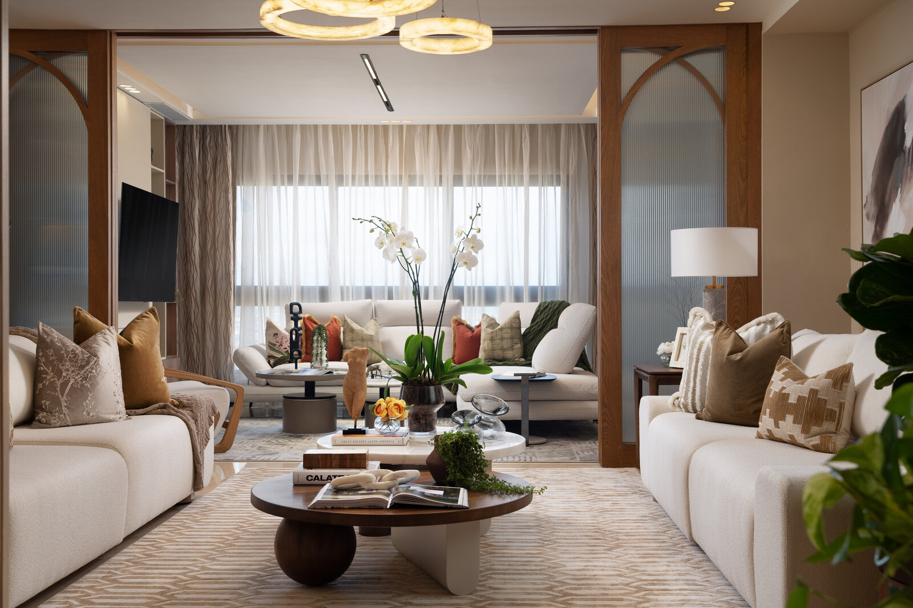

# CLAUDE.md

This file provides guidance to Claude Code (claude.ai/code) when working with code in this repository.

## What this is

A multi-page marketing site for **Torres Rodriguez Arquitectos** (Santo Domingo, DR), live at **https://trarq.com** (the apex is the primary domain in Vercel; `www` redirects to it, so every canonical / OG / sitemap URL uses the apex). Copy is entirely in Spanish. Five static HTML pages share one stylesheet and one script. No build step, no framework, no server code. Hosted on Vercel as a static site.

External services:
- **Google Fonts** — `Cormorant Garamond`, `Jost`
- **Google Tag Manager** — `GTM-M3QBFN9B`, snippet in every page's `<head>` + `<noscript>` after `<body>`
- **Web3Forms** — contact form posts straight from the browser
- **Behold.so** — Instagram feed widget on the home page

### Hosting & DNS (production — be careful)
DNS is **not** on Vercel. Nameservers are the client's cPanel host (`ns1/ns2.monkey.com.do`), and the zone is edited in cPanel → Zone Editor. Only two records point at Vercel: the apex `A` record and the `www` CNAME. **Email (MX → `mail.trarq.com`), webmail, SPF, DKIM and DMARC all live on the cPanel server.** Never move the nameservers to Vercel or "reset" the cPanel zone; that would take down the client's email or the website.

## File layout

```
ptorres/
├── index.html        # Home: full-bleed hero + section teasers
├── about.html        # Nosotros: story, philosophy, team (2 members)
├── gallery.html      # Proyectos: featured project + grid, lightbox per project
├── contact.html      # Contact info, Web3Forms form, FAQ accordion
├── privacy.html      # Privacy policy (prose)
├── favicon.ico
├── robots.txt / sitemap.xml
├── vercel.json       # Cache + security headers
├── assets/
│   ├── css/styles.css   # ALL styles (single source of truth)
│   ├── js/main.js       # ALL behavior
│   ├── img/             # hero, team, favicons, og-image, projects/<project>/NN-name.{jpg,webp}
│   └── brand/torres-rodriguez-brand.pdf
└── CLAUDE.md
```

Every page links `assets/css/styles.css` and `assets/js/main.js` and duplicates the same `<nav>`, mobile drawer and `<footer>` (no templating — edit all five pages together). Page content sits inside `<main id="main">`, which the skip link targets. The active nav item gets `class="is-active"` in both the desktop nav and the mobile drawer.

## Running / previewing

Serve the directory statically (`python3 -m http.server`) and visit `/`. The contact form works locally too (it posts to Web3Forms directly). `vercel.json` headers only apply on Vercel.

## Architecture

- **`styles.css`** — driven by custom properties on `:root` (light palette, the default). `[data-theme="dark"]` on `<html>` overrides them. There is **no** `@media (prefers-color-scheme: dark)` — light is the unconditional default.
- **`main.js`** — one IIFE; every feature is null-guarded so the file runs on every page. Features: theme toggle, scroll reveal, mobile nav drawer, gallery lightbox, FAQ accordion, contact-form validation + submit, custom select, Behold widget loader.

### Theme
- Saved choice lives in `localStorage['tr-theme']`; `"dark"` activates dark mode, anything else is light.
- Each page has a one-line inline `<script>` in `<head>` that applies a saved dark theme **before first paint** (otherwise dark-mode users see a light flash). It is the one sanctioned exception to the no-inline-script rule — keep it identical on all five pages.
- All `localStorage` access is wrapped in `try/catch`: it throws when site data is blocked, and an uncaught throw at the top of `main.js` would kill every feature on the page.

### Hidden UI and focus
The mobile drawer (`#navMobile`) and the lightbox (`#lightbox`) carry the `inert` attribute while closed, so their links/buttons are not tabbable or announced. `main.js` toggles `inert`, moves focus in on open (first drawer link / lightbox close button) and returns it on close. The lightbox traps Tab among its three buttons. Keep this pattern for any new off-screen UI.

## Brand palette (from PDF)

| Variable | Hex | Role |
|---|---|---|
| `--bg` | `#F2F0ED` | Page background (cream) |
| `--bg-2` | `#ECE6DA` | Secondary surface |
| `--bg-3` | `#E5DCCB` | Tertiary surface |
| `--surface` | `#CDBEA8` | Light beige / hairlines |
| `--accent-mid` | `#968774` | Mid taupe |
| `--accent` | `#5F4D3E` | Deep walnut (primary accent) |
| `--text` | `#2A2118` | Body text |
| `--text-muted` | `#6F6556` | Muted / secondary text (darkened from the PDF's `#8B7E6B` to meet WCAG AA 4.5:1 on `--bg`/`--bg-2`) |

Dark mode uses warm near-blacks rather than neutral grays. When changing colors, update both `:root` and `[data-theme="dark"]`, and keep small text at ≥ 4.5:1 contrast.

## Logo (TR monogram)

Embedded as a base64 PNG in `--logo-mark` on `:root` and applied with CSS masking (`.logo-mark { background-color: var(--accent); mask: var(--logo-mark) … }`), so it recolors with the theme. Do not replace it with a plain `background-image`.

## Images

- **Every photo ships as JPEG + WebP sibling** (`01-salon.jpg` + `01-salon.webp`) and is marked up as:
  ```html
  <picture>
    <source type="image/webp" srcset="assets/img/projects/merlot/01-salon.webp">
    
  </picture>
  ```
  Generate the WebP at the same dimensions, quality ~78 (e.g. `cwebp -q 78 in.jpg -o in.webp`). Keep `width`/`height` equal to the real pixel size.
- Project cards crop landscape photos into 4:5 boxes (`object-fit: cover`), so they need near-full resolution even on phones — don't ship smaller "thumbnails".
- `vercel.json` caches `/assets/img/*` for 30 days. **When replacing a photo, give it a new filename** (or returning visitors keep the old one).

## Hero (`index.html`)

A `<picture class="hero-media">` (WebP 1280/1920 `srcset` + `hero.jpg` 1920px fallback, `fetchpriority="high"`) absolutely positioned behind the text; the dark gradient overlay is `.hero::after` (heavier in dark mode). The source photo is square, so `sizes` uses `100vh` in portrait. To swap the photo, regenerate all three files and match the overlay strength to the new photo's luminance.

## Section pattern

```html
<div class="reveal">
  <span class="section-index">i — Label</span>
  <h2 class="section-title">Headline with <em>italic accent</em></h2>
</div>
```

## Home projects teaser

`#projects` shows 3 cards in a 6-col grid: one `.project.is-feature` (span 6, 16:7) and two span-3 (4:5). Cards link to `gallery.html`.

## Gallery page (`gallery.html`)

A featured project (`.gallery-feature`) above a `.gallery-grid`. Each card is an `article.project[data-project="<key>"]` with a `div.project-link[role=button][tabindex=0]`; clicking or Enter/Space opens the lightbox for that key. The photo lists live in `projectImages` in `main.js` (file basenames per project folder, shown as `.webp`); the "N fotos" badge on each card is filled from that list. **To add a project:** add the folder of `.jpg` + `.webp` files, add a key to `projectImages` and `projectNames`, and add the card. There is no category filter.

## About page (`about.html`)

Story (`.about`), philosophy quote (`.philosophy`), and a 2-member `.team` grid. Team photos are `` with real alt text.

## Contact page (`contact.html`)

- **Form** (`#contactForm`) posts JSON to `https://api.web3forms.com/submit`. The access key in the hidden input is public by design. Hidden fields: `from_name`, `subject`, and `botcheck` (Web3Forms honeypot checkbox, hidden via `.form-honeypot`). `main.js` validates name/email/message, sets `aria-invalid` + `aria-describedby` on errors, focuses the first invalid field, and shows success/error in `.form-status` (`role="status"`).
- **Custom select** ("Tipo de proyecto", `.cs`) follows the WAI-ARIA *select-only combobox* pattern: the `.cs-trigger` button has `role="combobox"`, `aria-expanded`, `aria-controls` and `aria-activedescendant`; focus never leaves it. Open state is the `.is-open` class on `.cs`. The chosen value goes into the hidden `<input name="project">` immediately before `.cs`.
- **FAQ** accordion (`.faq-item` / `.faq-q` / `.faq-a`), one open at a time.

## Instagram (`#instagram` on home)

The `.insta-grid` holds `<behold-widget feed-id="…">`; `main.js` injects the Behold script only when that element exists.

## Scroll reveal

Add `reveal` to any element (optionally `reveal-d1`/`-d2`/`-d3` for stagger). An `IntersectionObserver` adds `.visible`. `prefers-reduced-motion` disables reveals and the hero scroll cue.

## Conventions

- All copy is in Spanish.
- Styles live ONLY in `styles.css`; behavior ONLY in `main.js`. No inline `style=""` or `<script>` blocks — except the GTM snippets and the head theme snippet described above.
- `<nav>`, mobile drawer and `<footer>` are duplicated per page — change all five together.
- Animations: `.reveal` + `.reveal-dN` only.
- Absolute URLs (canonical, `og:*`, JSON-LD, sitemap) use `https://trarq.com/` (no `www`).
- Images go under `assets/img/`, referenced with relative paths (no leading slash), JPEG + WebP.
